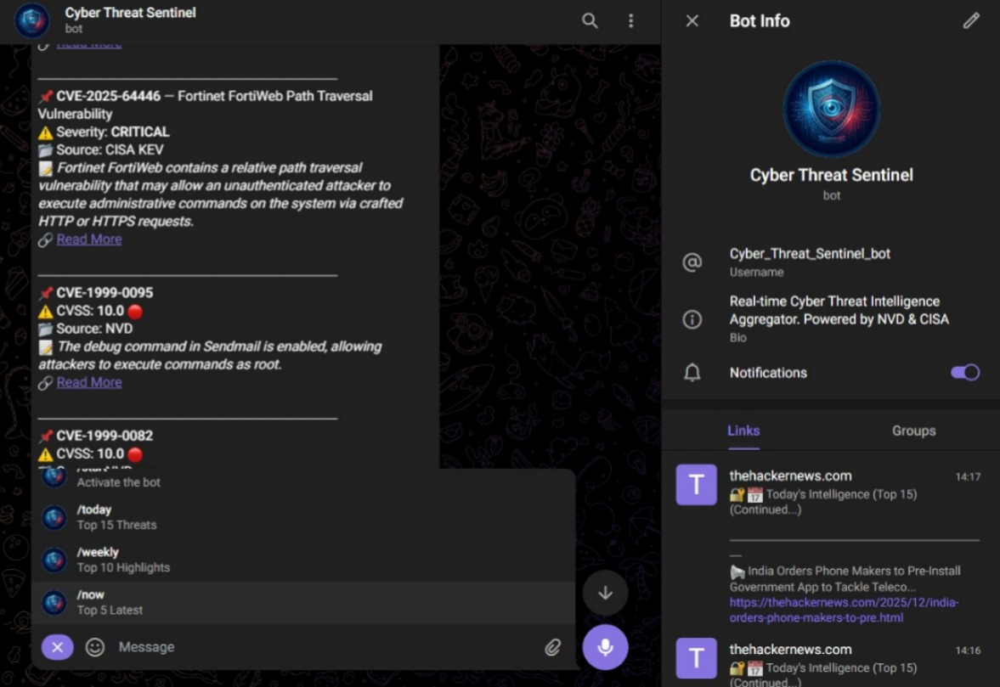

# 🛡️ Cyber Threat Sentinel (EWS Chatbot)



**Cyber Threat Sentinel** adalah sistem peringatan dini (*Early Warning System*) berbasis Bot Telegram yang dirancang untuk memantau, mengagregasi, dan memprioritaskan informasi kerentanan keamanan siber secara *real-time*.

Proyek ini mengimplementasikan algoritma **Agregasi Multi-Sumber** dan **Logika Prioritas** untuk menyaring *Information Overload* bagi administrator jaringan, berfokus pada kerentanan yang sedang aktif dieksploitasi (*Known Exploited Vulnerabilities*).

> **Judul Penelitian:** Rancang Bangun Sistem Peringatan Dini Known Exploited Vulnerabilities Secara Real-time Berbasis Bot Telegram Menggunakan Integrasi API NVD dan CISA.

---

## ✨ Fitur Unggulan

Sistem ini memiliki kemampuan cerdas untuk menormalisasi data dari sumber heterogen:

1.  **Prioritization Engine:** Algoritma cerdas yang mengurutkan ancaman berdasarkan urgensi:
    * 🚨 **CRITICAL:** CISA KEV (Kerentanan yang sedang diserang hacker).
    * 🔥 **HIGH RISK:** NVD (Kerentanan dengan skor CVSS tertinggi).
    * 📰 **INFO:** Berita siber terbaru.
2.  **Multi-Source Integration:**
    * **NVD (NIST):** Data teknis CVE & CVSS Score.
    * **CISA:** Daftar *Known Exploited Vulnerabilities*.
    * **The Hacker News:** Berita terkini (via Web Scraper dengan fitur *Ad-Filtering*).
    * **RSS Feed:** Cadangan otomatis (*Fail-over*) jika Scraper terkendala.
3.  **Smart Formatting:** Mengubah data JSON/HTML mentah menjadi laporan yang mudah dibaca di Telegram.
4.  **Scheduled Reporting:** Laporan intelijen otomatis dikirim ke grup setiap **6 jam** (Pagi, Siang, Sore, Malam).

---

## 🛠️ Teknologi

* **Python 3.10+**
* **python-telegram-bot** (Asyncio Framework)
* **Flask** (Untuk menjaga bot tetap hidup di server cloud)
* **BeautifulSoup4** (Web Scraping)
* **Feedparser** (RSS Reader)
* **SQLite** (Database Log - *Opsional*)

---

## 🚀 Instalasi & Konfigurasi

Ikuti langkah ini untuk menjalankan bot di lokal atau server (VPS/Render).

### 1. Clone Repository
```bash
git clone [https://github.com/ranseraya/Bot_CyberSentinel.git](https://github.com/ranseraya/Bot_CyberSentinel.git)
cd Bot_CyberSentinel

### 2\. Install Dependencies

Pastikan Python sudah terinstall, lalu jalankan:

```bash
pip install -r requirements.txt
```

### 3\. Konfigurasi Environment (PENTING 🔐)

Demi keamanan, proyek ini menggunakan **Environment Variables**.
Buat file bernama `.env` di dalam folder root proyek, lalu isi dengan data Anda:

```ini
# .env file
TELEGRAM_TOKEN=123456:ABC-DEF1234ghIkl-zyx57W2v1u123ew11
CHAT_ID=-100xxxxxxxxxx
NVD_API=nvd-api-key
```

-----

## ▶️ Cara Menjalankan

### Mode Lokal / Development

Jalankan perintah berikut di terminal:

```bash
python main.py
```

Jika sukses, akan muncul log: `INFO:__main__:Bot Ready.`

### Deployment (Render/Railway)

Proyek ini sudah dikonfigurasi agar kompatibel dengan layanan Cloud seperti Render.

1.  Pastikan file `requirements.txt` ada.
2.  Set **Start Command**: `python main.py`
3.  Masukkan variabel `TELEGRAM_TOKEN`, `CHAT_ID`, dan `NVD_API` di menu **Environment Variables** pada dashboard cloud Anda.

-----

## 📱 Daftar Perintah Bot

| Command | Deskripsi |
| :--- | :--- |
| `/start` | Mengaktifkan bot dan menampilkan menu bantuan. |
| `/today` | Menampilkan **Top 15** ancaman terpenting hari ini (Gabungan CISA, NVD, News). |
| `/weekly` | Menampilkan **Top 10** highlight mingguan (Fokus High Risk). |
| `/now` | Menampilkan **Top 5** update terbaru detik ini juga (*Real-time*). |

-----

## 📂 Struktur Direktori

```text
CyberSentinel/
├── services/               # Modul Pengambil Data (Fetcher)
│   ├── cisa_service.py     # API CISA KEV
│   ├── nvd_service.py      # API NVD NIST
│   ├── scraper_service.py  # Web Scraper (TheHackerNews)
│   └── rss_service.py      # RSS Feed Reader (Backup)
├── utils/                  
│   └── formatter.py        # Normalisasi Data & Format HTML Telegram
├── main.py                 # Otak Utama (Scheduler & Logic Prioritas)
├── config.py               # Loader Konfigurasi (.env)
├── .env                    # File Rahasia (Token & API Key)
└── requirements.txt        # Daftar Pustaka
```

-----

## ⚠️ Disclaimer

Aplikasi ini dikembangkan sebagai bagian dari penelitian akademis. Penggunaan data NVD dan CISA tunduk pada ketentuan layanan masing-masing instansi. Fitur *Web Scraping* telah disesuaikan agar mematuhi etika pengambilan data publik.

-----

**Developed by Ayala**
Mahasiswa Informatika - UPN Veteran Jawa Timur

```
```